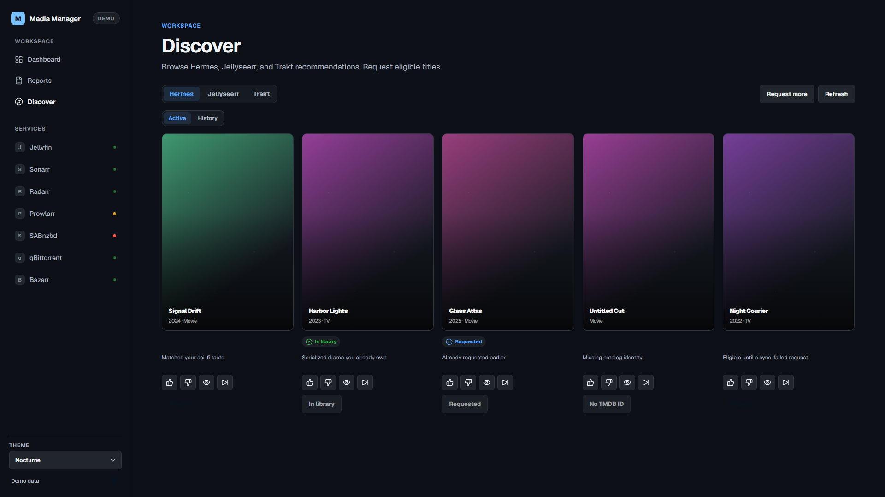
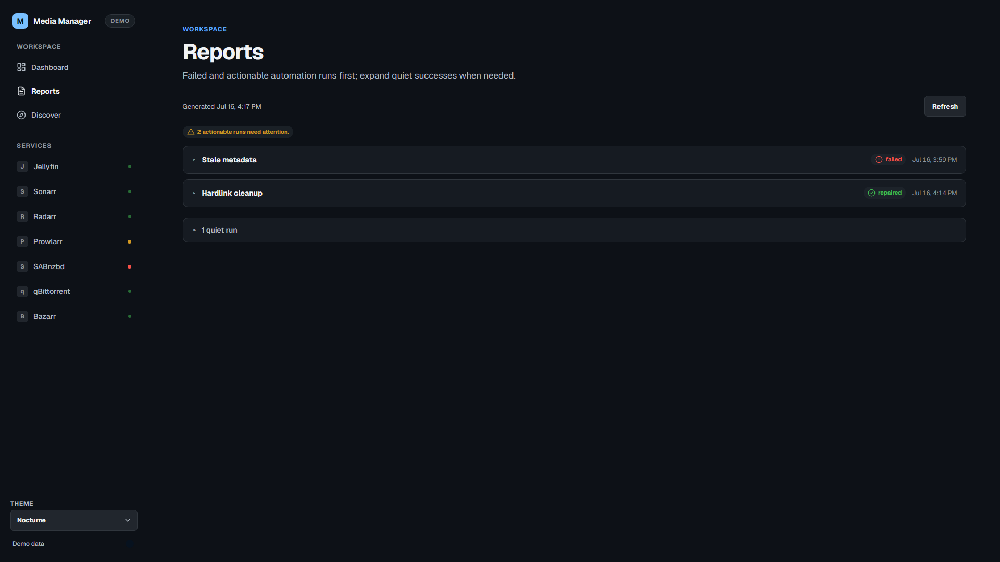
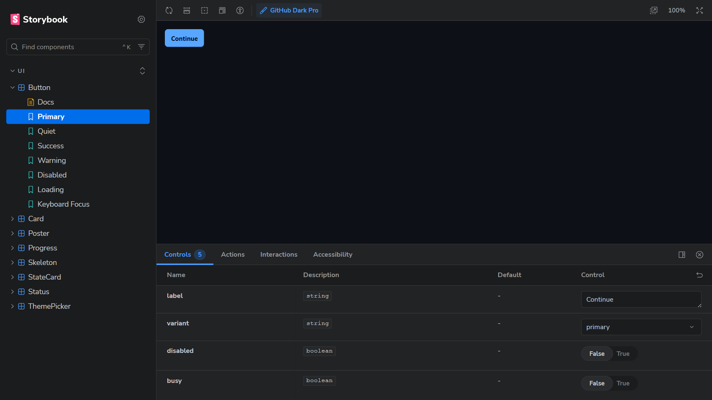

# Media Manager Angular

Angular 22 workspace for the Media Manager shell: a single `dashboard` app with local design system (`app/ui`) and API boundary (`app/media-stack`). Containerized with Nginx reverse proxy for Docker deployment.

## Repository layout

This is a monorepo. The Angular workspace lives in [`dashboard-app/`](dashboard-app/) — **run all npm commands there**. The repo root carries the production media stack: `docker-compose.yml`, the `homepage-actions` Live API under `config/homepage-actions/`, and the Hermes recommendation contract under `config/recommendations/`.

## First-time install

On a blank Windows machine (PowerShell 7+):

```powershell
.\install.ps1 -Mode both
```

| Mode | What it does |
|------|--------------|
| `frontend-dev` | Checks Node 20+, runs `npm ci` in `dashboard-app/`, prints Demo/Live commands |
| `stack` | Checks Docker + Node, creates `.env` from `.env.example` (generated `ACTIONS_TOKEN`, prompted paths/password), builds and tags the dashboard image, `docker compose up -d`, prints the API-key checklist |
| `both` | `frontend-dev`, then `stack` |

Flags: `-Force` recreates `.env`; `-Gpu` merges `docker-compose.gpu.yml` (NVIDIA transcoding); `-SkipBuild` reuses the existing dashboard image.

Prerequisites: Docker Desktop, Node.js 20+, PowerShell 7+. Optional: NVIDIA GPU + nvidia-container-toolkit for `-Gpu`.

After `stack` mode, open each service UI, copy its API key into `.env`, then `docker compose up -d` to apply. The installer intentionally does not configure indexers, libraries, or service API keys — those need each app's first-run UI.

## Compose profiles

Plain `docker compose up -d` starts only the core stack: Jellyfin, qBittorrent, Sonarr, Radarr, Prowlarr, homepage-actions, and the Angular dashboard. Optional services use these profiles:

| Profile | Services |
|---------|----------|
| `subtitles` | Bazarr |
| `requests` | Jellyseerr |
| `maintenance` | Maintainerr, Recyclarr, Unpackerr |
| `indexer-tools` | FlareSolverr |

Start selected profiles with:

```powershell
docker compose --profile subtitles --profile requests --profile maintenance --profile indexer-tools up -d
```

Set `BAZARR_ENABLED=true` and/or `JELLYSEERR_ENABLED=true` only after the matching service is configured. Disabled or unconfigured optional capabilities are omitted from actionable health; configured but unreachable services remain degraded/down. Keep normal host profile values in ignored local operational docs, not in `.env.example` or committed configuration.

Existing hosts upgrading from the key-only setup must explicitly add `BAZARR_ENABLED=true` and/or `JELLYSEERR_ENABLED=true` to `.env` for each optional service they use, enable the matching Compose profiles, and run `docker compose up -d` again. API keys alone no longer enable these capabilities; leave the flags false for intentionally disabled services.

## Quick start (Demo / mock)

```bash
cd dashboard-app
npm ci
npm start
```

Open [http://localhost:4200/](http://localhost:4200/). Default startup uses in-process mock data (**Demo** badge) and makes no private API calls.

| Route | Surface |
|-------|---------|
| `/` | Nocturne ops dashboard: metrics, attention banner, active downloads, recent runs, upcoming calendar, service health, storage |
| `/reports` | Status-weighted automation / cron triage |
| `/discover` | Hermes, Jellyseerr, and Trakt recommendations |
| Storybook | Design-system showcase — `npm run storybook` → [http://localhost:6006/](http://localhost:6006/) |

## Production deployment (Docker)

The production-live build is containerized with Nginx as reverse proxy. It must run on the same Docker network as the `homepage-actions` backend (typically `media_media-net`).

```bash
npm run build:live
docker build -t media-dashboard-angular:local .
```

The image is deployed through Docker Compose alongside the backend services. For local verification with an existing Compose setup:

```bash
docker run --rm -p 3000:80 \
  --network media_media-net \
  -e ACTIONS_TOKEN=... \
  media-dashboard-angular:local
```

Open [http://127.0.0.1:3000/](http://127.0.0.1:3000/).

### Media stack cutover (`D:\media`)

Production dashboard on the stack is the **immutable-tagged** Angular image (not `docker build` from this repo on every deploy).

| Phase | Command / check |
|-------|-----------------|
| Build image | `docker build -t media-dashboard-angular:<short-sha> -t media-dashboard-angular:local .` after `npm run build:live` |
| Staging (done) | Compose service `dashboard-angular-stage` on `127.0.0.1:3001` — removed after M4 |
| Production | `dashboard` service uses `image: media-dashboard-angular:<short-sha>` on `:3000` |
| Smoke against stack | `SMOKE_BASE_URL=http://127.0.0.1:3000 npm run test:smoke` (from this repo; does not start `ng serve`) |
| Emergency React rollback | On `D:\media`: `docker compose stop dashboard`; `$env:LEGACY_DASHBOARD_PORT='3000'; docker compose --profile legacy-dashboard up -d dashboard-react`; verify; `docker compose --profile legacy-dashboard rm -sf dashboard-react`; `Remove-Item Env:LEGACY_DASHBOARD_PORT`; `docker compose up -d dashboard` |

Do not persist a universal `COMPOSE_PROFILES` default in committed configuration. `legacy-dashboard` is only for the documented emergency rollback and must not be part of the normal host profile set. Legacy React image: `media-dashboard-react:legacy-77b344ef4f65` (image ID pinned — do not rebuild). Ops dates and IDs: `D:\media\docs\fdm-529-cutover-baseline.md`.

**Request flow:**

```
Browser → http://127.0.0.1:3000
  → Angular Nginx
    /        → Angular static files
    /api/*   → homepage-actions:8085/* (with X-Actions-Token header)
```

- Nginx strips `/api` via trailing-slash `proxy_pass`.
- `ACTIONS_TOKEN` is injected by Compose/Nginx from the container environment and never emitted into JavaScript, HTML, or source maps.
- The browser never sees the token and never connects directly to backend services.

## Live dev mode (optional)

With a local [`homepage-actions`](config/homepage-actions/) service on port **8085**:

```bash
npm run start:live
```

- Proxies `/api` → `http://127.0.0.1:8085` via [dashboard-app/projects/dashboard/proxy.conf.js](dashboard-app/projects/dashboard/proxy.conf.js).
- Set `ACTIONS_TOKEN` in the environment when mutating requests need `X-Actions-Token`.
- Feature components stay unchanged; only the `MediaStackApi` adapter switches.

Live mode is **local-only**. Do not point a static host at the live configuration.

## Scripts

| Script | Purpose |
|--------|---------|
| `npm start` | Demo serve (`:4200`) |
| `npm run start:live` | Live serve with API proxy |
| `npm run lint` | Rigorous ESLint (typed + strict, used by `quality` gate) |
| `npm run lint:fast` | Fast ESLint (day-to-day editing, used by `lint:agent`) |
| `npm run lint:fix` | Rigorous ESLint with auto-fix |
| `npm run lint:styles:fix` | Stylelint with auto-fix |
| `npm run quality` | **Full gate** — lint + typecheck + styles + duplicates + dead-code + architecture in parallel |
| `npm test -- --watch=false` | Vitest unit / facade / page specs |
| `npm run test:smoke` | Playwright direct-route and assembled-app smoke checks (auto-starts dev server) |
| `npm run build` | Canonical production (Demo mode) build |
| `npm run build:live` | Production-live Docker build (optimized, no source maps, live backend) |
| `npm run storybook` | Interactive Storybook (includes a11y addon / play functions) |
| `npm run build:storybook` | Compile Storybook static output |
| `npm run test:storybook` | Serve `storybook-static` and run interaction/a11y checks (`@storybook/test-runner`) |

## Quality gate

`npm run quality` runs all six checks in parallel via `concurrently`:

| Tool | Command | Exit | Expected |
|------|---------|------|----------|
| **ESLint** (typed + strict) | `npm run lint` | **FAIL** on errors | Auto-fix with `npm run lint:fix` |
| **TypeScript** | `npm run typecheck` | **FAIL** on errors | Fix type errors |
| **Stylelint** | `npm run lint:styles` | **FAIL** on errors | Auto-fix with `npm run lint:styles:fix` |
| **jscpd** (duplication) | `npm run quality:duplicates` | **FAIL** ≥3% | Refactor — do not add ignores |
| **Knip** (dead code) | `npm run quality:dead-code` | **FAIL** on unused | Remove or justify exports |
| **Dependency Cruiser** | `npm run quality:architecture` | **FAIL** on violations | Respect module boundaries |

**PASS** = zero exit. **WARN / INFO** = tool-specific warnings that do not block. **FAIL** = non-zero exit.

**Rules:**
- Do not add ignore comments or abstractions solely to silence the gate.
- Ponytail (lazy/simplification mindset) remains a review principle for agents, not a lint rule.
- `no-orphans` is removed from Dependency Cruiser; Knip owns unused-code detection.
- jscpd clones below 3% are informational — address during refactors.

All six checks run independently: one failure does not kill the others. Commit hook and CI both enforce `npm run quality`. Tests and build run after quality in CI.

## Themes

Dark themes only (light themes are out of scope):

- **Nocturne** (default)
- **Tokyo Night**
- **GitHub Dark Pro**

Switch from the top-bar theme picker; preference persists in `localStorage` (`media-ui-theme`).

## Architecture

See [dashboard-app/docs/architecture.md](dashboard-app/docs/architecture.md) for the port → adapter → facade → page flow, Demo/Live modes, and operational link policy.

## Testing

- **Unit / integration:** Vitest via `ng test` (facades, boards, pages, shell navigation, API boundary).
- **Storybook:** Interactive review via `npm run storybook`. CI runs `build:storybook` then `test:storybook` (play functions + a11y).
- **Browser acceptance:** Playwright verifies direct routes, fallback routing, titles, theme persistence, and shell navigation via `npm run test:smoke`. The broader manual desktop checklist remains in [dashboard-app/docs/browser-acceptance.md](dashboard-app/docs/browser-acceptance.md). Loading / empty / failure isolation that cannot be selected in Demo UI is covered by named unit specs listed there.

## Screenshots

Representative Demo captures (local showcase):

| Home | Discover |
|------|----------|
|  |  |

| Reports | Tokyo Night |
|---------|-------------|
|  |  |



The Home dashboard was rebuilt to the Nocturne ops-console spec (fixed 285px sidebar, 12-column grid, metric cards, service health, storage overview). Screenshots are regenerated after each major visual pass; see [dashboard-app/docs/screenshots/README.md](dashboard-app/docs/screenshots/README.md).

## Non-goals

- Published to npm/hosting (private self-hosted Docker deployment)
- Light themes or responsive certification
- Backend rewrite or secrets in this repo

## Verification

```bash
npm ci
npm start
# in another shell:
npm run quality
npm test -- --watch=false
npm run test:smoke
npm run build
npm run build:storybook
npm run test:storybook
```
