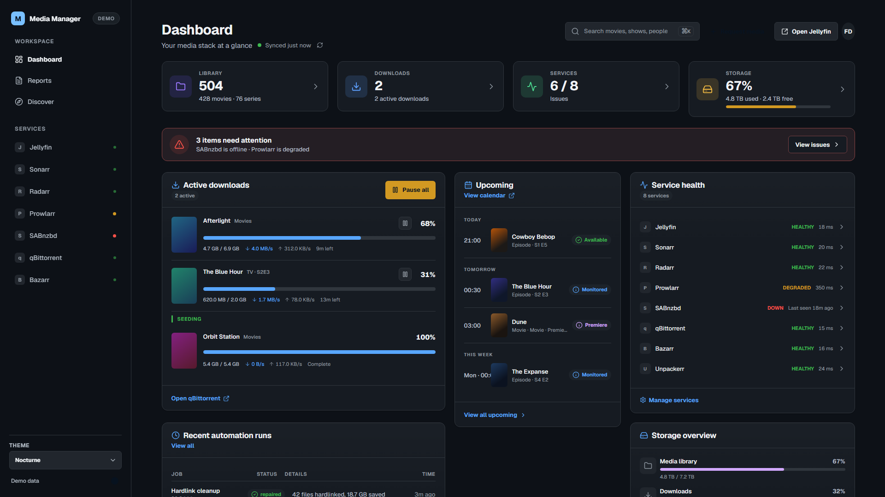
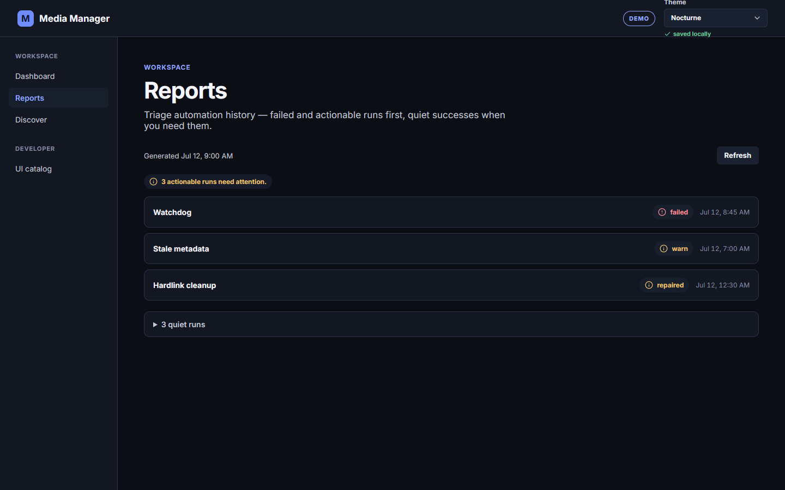
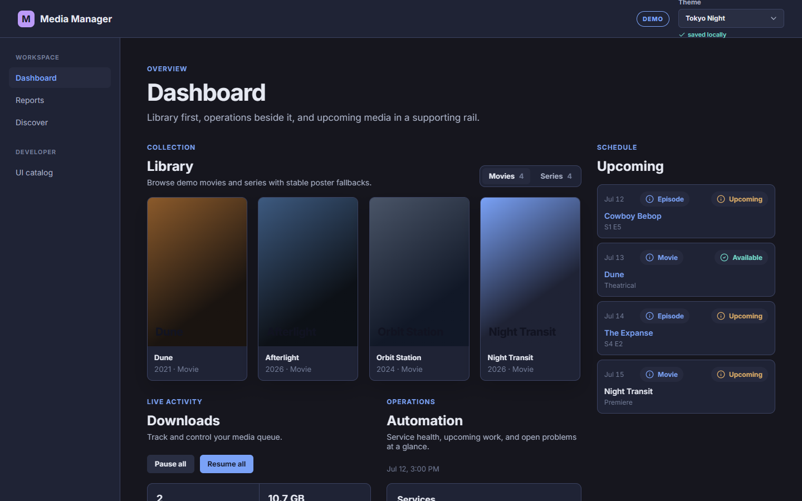
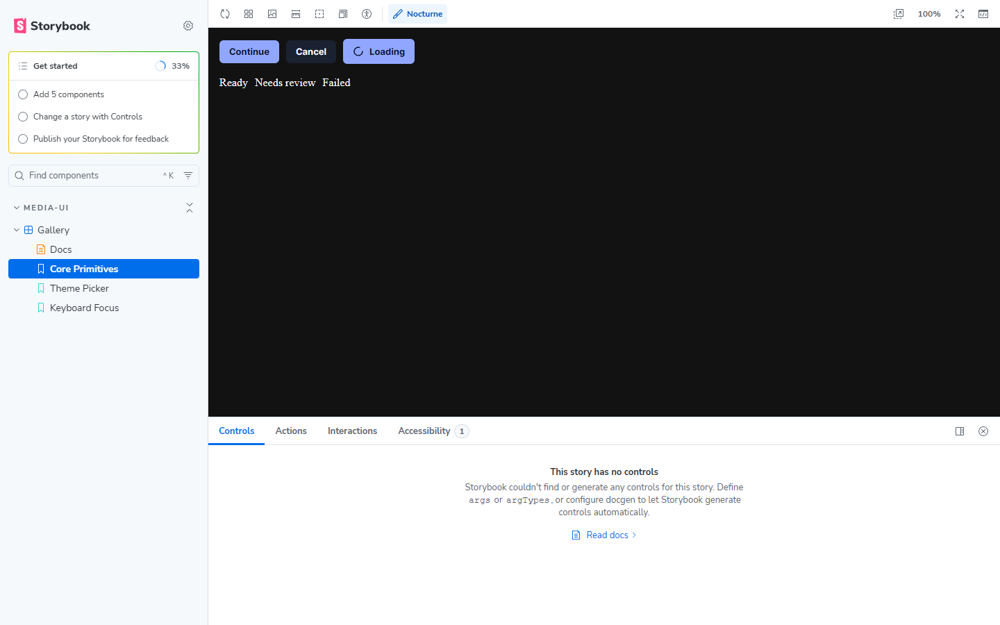

# Media Manager Angular

Angular 22 workspace for the Media Manager shell: a single `dashboard` app with local design system (`app/ui`) and API boundary (`app/media-stack`).

This repository is currently a **private local showcase**. Public GitHub Pages is deferred; run Demo mode locally to evaluate the product.

## Quick start (Demo / mock)

```bash
npm ci
npm start
```

Open [http://localhost:4200/](http://localhost:4200/). Default startup uses in-process mock data (**Demo** badge) and makes no private API calls.

| Route | Surface |
|-------|---------|
| `/` | Nocturne ops dashboard: metrics, attention banner, active downloads, recent runs, upcoming calendar, service health, storage |
| `/reports` | Status-weighted automation / cron triage |
| `/discover` | Hermes, Jellyseerr, and Trakt recommendations |
| Storybook | Design-system showcase — `npm run storybook` → [http://localhost:6006/](http://localhost:6006/) |

## Live mode (optional)

With a local [`homepage-actions`](https://github.com/fernandodamaso) service on port **8085**:

```bash
npm run start:live
```

- Proxies `/api` → `http://127.0.0.1:8085` via [projects/dashboard/proxy.conf.js](projects/dashboard/proxy.conf.js).
- Set `ACTIONS_TOKEN` in the environment when mutating requests need `X-Actions-Token`.
- Feature components stay unchanged; only the `MediaStackApi` adapter switches.

Live mode is **local-only**. Do not point a static host at the live configuration.

## Scripts

| Script | Purpose |
|--------|---------|
| `npm start` | Demo serve (`:4200`) |
| `npm run start:live` | Live serve with API proxy |
| `npm run lint` | ESLint |
| `npm test -- --watch=false` | Vitest unit / facade / page specs |
| `npm run test:smoke` | Playwright direct-route and assembled-app smoke checks (auto-starts dev server) |
| `npm run build` | Canonical production dashboard build |
| `npm run storybook` | Interactive Storybook (includes a11y addon / play functions) |
| `npm run build:storybook` | Compile Storybook static output |
| `npm run test:storybook` | Serve `storybook-static` and run interaction/a11y checks (`@storybook/test-runner`) |

## Themes

Dark themes only (light themes are out of scope):

- **Nocturne** (default)
- **Tokyo Night**
- **GitHub Dark Pro**

Switch from the top-bar theme picker; preference persists in `localStorage` (`media-ui-theme`).

## Architecture

See [docs/architecture.md](docs/architecture.md) for the port → adapter → facade → page flow, Demo/Live modes, and operational link policy.

## Testing

- **Unit / integration:** Vitest via `ng test` (facades, boards, pages, shell navigation, API boundary).
- **Storybook:** Interactive review via `npm run storybook`. CI runs `build:storybook` then `test:storybook` (play functions + a11y).
- **Browser acceptance:** Playwright verifies direct routes, fallback routing, titles, theme persistence, and shell navigation via `npm run test:smoke`. The broader manual desktop checklist remains in [docs/browser-acceptance.md](docs/browser-acceptance.md). Loading / empty / failure isolation that cannot be selected in Demo UI is covered by named unit specs listed there.

## Screenshots

Representative Demo captures (local showcase):

| Home | Discover |
|------|----------|
|  |  |

| Reports | Tokyo Night |
|---------|-------------|
|  |  |



The Home dashboard was rebuilt to the Nocturne ops-console spec (fixed 285px sidebar, 12-column grid, metric cards, service health, storage overview). Screenshots are regenerated after each major visual pass; see [docs/screenshots/README.md](docs/screenshots/README.md).

## Non-goals

- Making the repository public or enabling GitHub Pages (deferred by owner decision)
- npm package publication
- Light themes or responsive certification
- Replacing the React deployment
- Backend rewrite or secrets in this repo
- Development-only mock scenario selectors

## Verification

```bash
npm ci
npm start
# in another shell:
npm run lint
npm test -- --watch=false
npm run test:smoke
npm run build
npm run build:storybook
npm run test:storybook
```
